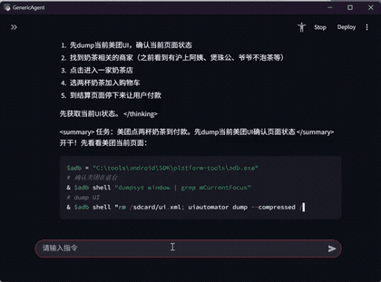
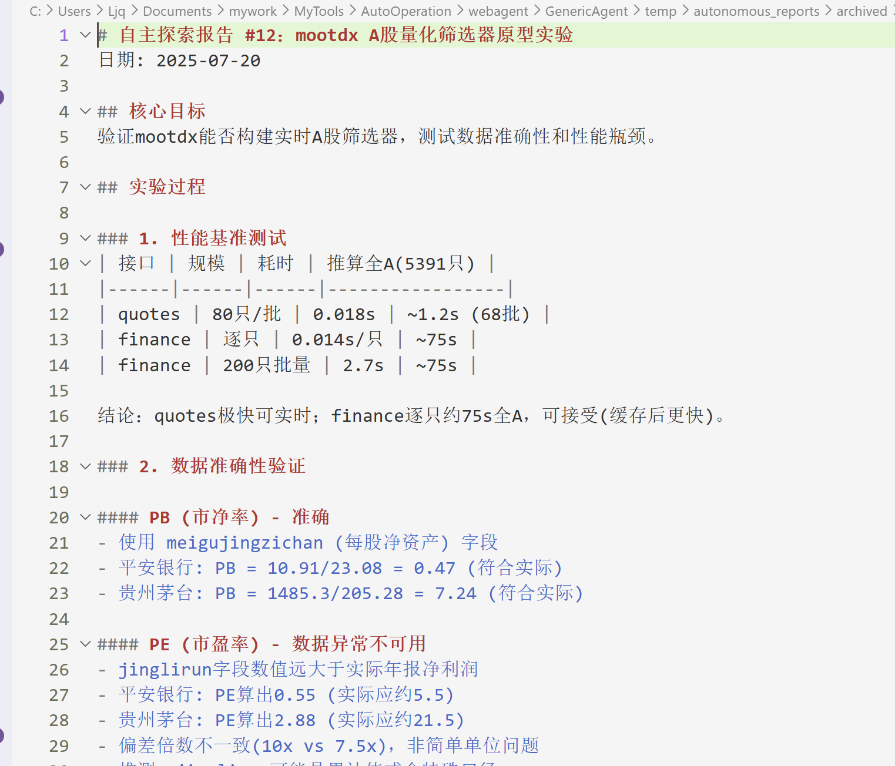
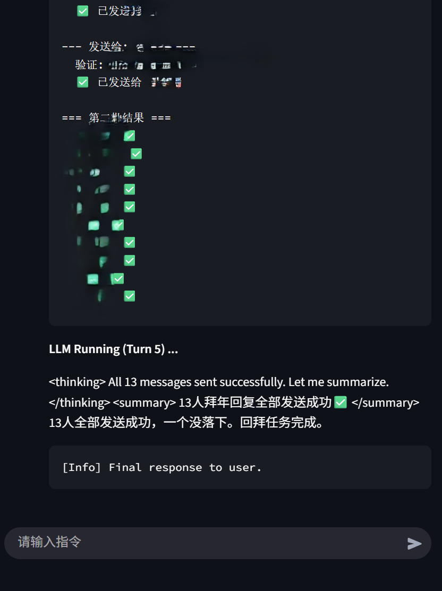

# GenericAgent — 3,300 Lines to Full OS Autonomy

[English](#english) | [中文](#chinese)

<a name="english"></a>

A minimalist autonomous agent framework that gives any LLM physical-level control over your PC — browser, terminal, file system, keyboard, mouse, screen vision, and mobile devices — in ~3,300 lines of Python.

No Electron. No Docker. No Mac Mini. No 500K-line codebase. No paid installation service.

## See It in Action

<table>
<tr>
<td width="45%" align="center"><br><em>"Order me a milk tea" — navigates a delivery app, picks items, and checks out.</em></td>
<td width="55%" align="center"><br><em>"Find GEM stocks with EXPMA golden cross, turnover > 5%" — quantitative screening via mootdx.</em></td>
</tr>
</table>

<table>
<tr>
<td width="33%"><br><em>Autonomous web exploration — browses and summarizes on its own schedule.</em></td>
<td width="34%"><br><em>"Find expenses over ¥2K in the past 3 months" — drives Alipay on a phone via ADB.</em></td>
<td width="33%"><br><em>WeChat batch messaging — yes, it can drive WeChat too.</em></td>
</tr>
</table>

## What Happens When You Use It

```
You: "Read my WeChat messages"
Agent: installs dependencies → reverse-engineers DB → writes reader script → saves as SOP
Next time: instant recall, zero setup.

You: "Monitor stock prices and alert me"
Agent: installs mootdx → builds screening workflow → sets up scheduled task → saves as SOP
Next time: one sentence to run.

You: "Send this file via Gmail"
Agent: configures OAuth → writes send script → saves as SOP
Next time: just works.
```

**Dogfooding**: This repository — from installing Git to `git init`, writing this README, to every commit message — was built entirely by GenericAgent without the author opening a terminal once.

Every task the agent solves becomes a permanent skill. After a few weeks, your instance has a unique skill tree — grown entirely from 3,300 lines of seed code.

## The Seed Philosophy

Most agent frameworks ship as finished products. GenericAgent ships as a **seed**.

The 5 core SOPs define how the agent thinks, remembers, and operates. From there, every new capability is discovered and recorded by the agent itself:

1. You ask it to do something new
2. It figures out how (install dependencies, write scripts, test)
3. It saves the procedure as a new SOP in its memory
4. Next time, it recalls and executes directly

The agent doesn't just execute — it **learns and remembers**.

## Quick Start

> 💡 **Windows零基础用户**：不知道Python是什么？[下载便携版](http://kw.fudan.edu.cn/resources/PC-Agent-Portable.zip)（19MB，解压即用）

```bash
# 1. Clone
git clone https://github.com/lsdefine/GenericAgent.git
cd GenericAgent

# 2. Install minimal deps
pip install streamlit pywebview

# 3. Configure API key
cp mykey_template.py mykey.py
# Edit mykey.py with your LLM API key

# 4. Launch
python launch.pyw
```

## QQ Bot (Optional)

QQ support uses `qq-botpy` over WebSocket, so no public webhook is required.

```bash
pip install qq-botpy
```

Then add these fields to `mykey.py` or `mykey.json`:

```python
qq_app_id = "YOUR_APP_ID"
qq_app_secret = "YOUR_APP_SECRET"
qq_allowed_users = ["YOUR_USER_OPENID"]  # or ['*'] for public access
```

Run QQ directly:

```bash
python qqapp.py
```

Or start it together with the desktop window:

```bash
python launch.pyw --qq
```

Notes:
- Create the bot at [QQ Open Platform](https://q.qq.com)
- In sandbox mode, add your own QQ account to the message list first
- After the first inbound message, the user's openid will be written to `temp/qqapp.log`

## Feishu / WeCom / DingTalk (Optional)

Feishu:

```bash
pip install lark-oapi
python fsapp.py
# or
python launch.pyw --feishu
```

Config keys in `mykey.py` / `mykey.json`:

```python
fs_app_id = "cli_xxx"
fs_app_secret = "xxx"
fs_allowed_users = ["ou_xxx"]  # or ['*']
```

Current Feishu support in this repo:
- inbound: text, post rich text, image, file, audio, media, interactive/share cards
- images are sent to multimodal-capable OpenAI-compatible backends as true image inputs on the first turn
- outbound: interactive progress cards, uploaded image replies, uploaded file/media replies

Detailed setup guide: `assets/SETUP_FEISHU.md`

WeCom:

```bash
pip install wecom_aibot_sdk
python wecomapp.py
# or
python launch.pyw --wecom
```

Config keys:

```python
wecom_bot_id = "your_bot_id"
wecom_secret = "your_bot_secret"
wecom_allowed_users = ["your_user_id"]  # or ['*']
wecom_welcome_message = "Hello"
```

DingTalk:

```bash
pip install dingtalk-stream
python dingtalkapp.py
# or
python launch.pyw --dingtalk
```

Config keys:

```python
dingtalk_client_id = "your_app_key"
dingtalk_client_secret = "your_app_secret"
dingtalk_allowed_users = ["your_staff_id"]  # or ['*']
```

**Also runs on Android** — tested successfully on Termux with `python agentmain.py` (CLI frontend):

```bash
# In Termux
cd /sdcard/ga
python agentmain.py
```

Once running, tell the agent: *"Execute web setup SOP to unlock browser tools"* — it handles the rest. See [WELCOME_NEW_USER.md](WELCOME_NEW_USER.md) for the full bootstrap sequence.

## vs. Alternatives

| | GenericAgent | OpenClaw | Claude Code |
|---|---|---|---|
| Codebase | ~3,300 lines | ~530,000 lines | Open-source (large) |
| Deploy | `pip install` + API key | Multi-service orchestration | CLI + subscription |
| Browser | Injects into real browser (keeps login state) | Sandboxed/headless | Via MCP plugins |
| OS Control | Keyboard, mouse, vision, ADB | Multi-agent delegation | File + terminal |
| Self-evolution | Grows SOPs & tools autonomously | Plugin ecosystem | Stateless per session |
| Core shipped | 10 .py + 5 SOPs | Hundreds of modules | Rich CLI toolkit |

## How It Works

```
User instruction
      ↓
┌─────────────────────┐
│  agent_loop.py (92L) │  ← Sense-Think-Act cycle
│  "What do I know?    │
│   What should I do?" │
└────────┬────────────┘
         ↓
┌─────────────────────┐
│  7 Atomic Tools      │  ← All capabilities derive from these
│  code_run            │     Execute any Python/PowerShell
│  file_read/write     │     Direct disk access
│  file_patch          │     Surgical code edits
│  web_scan            │     Read live web pages
│  web_execute_js      │     Control browser DOM
│  ask_user            │     Human-in-the-loop
└────────┬────────────┘
         ↓
┌─────────────────────┐
│  Memory System       │  ← Persistent across sessions
│  L0: Meta-SOP        │     How to manage memory itself
│  L2: Global Facts    │     Environment, credentials, paths
│  L3: Task SOPs       │     Learned procedures (self-growing)
└─────────────────────┘
```

The agent starts with 7 primitive tools. Through `code_run`, it can install packages, write scripts, and interface with any hardware or API — effectively manufacturing new tools at runtime.

<details>
<summary>What Ships in the Box</summary>

**Core engine** (runs the agent):
- `agent_loop.py` — Sense-Think-Act loop (92 lines)
- `ga.py` — Tool definitions and execution
- `llmcore.py` — LLM communication (multi-backend)
- `agentmain.py` — Session orchestration

**Interface** (talk to the agent):
- `stapp.py` — Streamlit web UI
- `tgapp.py` — Telegram bot interface
- `fsapp.py` — Feishu bot interface
- `qqapp.py` — QQ bot interface
- `wecomapp.py` — WeCom bot interface
- `dingtalkapp.py` — DingTalk bot interface
- `launch.pyw` — One-click launcher with floating window

**Infrastructure**:
- `TMWebDriver.py` — Browser injection bridge (not Selenium — injects JS into your real browser via Tampermonkey)
- `simphtml.py` — HTML→text cleaner for web perception

**5 Core SOPs** (shipped, version-controlled):
1. `memory_management_sop` — L0 constitution: how the agent manages its own memory
2. `autonomous_operation_sop` — Self-directed task execution
3. `scheduled_task_sop` — Cron-like recurring tasks
4. `web_setup_sop` — Browser environment bootstrap
5. `ljqCtrl_sop` — Desktop physical control (keyboard, mouse, DPI-aware)

Everything else — Gmail integration, WeChat automation, vision APIs, game downloaders, stock analysis workflows — the agent builds and memorizes on its own through use.

</details>

---

<a name="chinese"></a>

# GenericAgent — 3,300 行代码，完整 OS 级自主控制

一个极简自主 Agent 框架。用约 3,300 行 Python，让任意 LLM 获得对你 PC 的物理级控制能力——浏览器、终端、文件系统、键鼠、屏幕视觉、移动设备。

不需要 Electron，不需要 Docker，不需要 Mac Mini，不需要 53 万行代码，不需要付费安装服务。

## 用起来是什么样的

```
你："帮我读取微信消息"
Agent：安装依赖 → 逆向数据库 → 写读取脚本 → 保存为 SOP
下次：一句话直接调用，零配置。

你："帮我监控股票并提醒"
Agent：安装 mootdx → 构建选股工作流 → 设置定时任务 → 保存为 SOP
下次：一句话启动。

你："用 Gmail 发这个文件"
Agent：配置 OAuth → 写发送脚本 → 保存为 SOP
下次：直接能用。
```

**自举实证**：本仓库从安装 Git、`git init`、编写 README 到每一条 commit message，全程由 GenericAgent 完成——作者没有打开过一次终端。

每个解决过的任务都会变成永久技能。用几周后，你的 Agent 实例会拥有一套独特的技能树——全部从 3,300 行种子代码中生长出来。

## 自举哲学

多数 Agent 框架以成品形态发布。GenericAgent 以**种子**形态发布。

5 个核心 SOP 定义了 Agent 如何思考、记忆和行动。之后的一切能力，由 Agent 在使用中自主发现并记录：

1. 你让它做一件新事
2. 它自己摸索方法（安装依赖、写脚本、测试）
3. 把流程保存为新 SOP
4. 下次直接调用

Agent 不只是执行——它**学习并记忆**。

## 快速开始

```bash
# 1. 克隆
git clone https://github.com/lsdefine/GenericAgent.git
cd GenericAgent

# 2. 安装最小依赖
pip install streamlit pywebview

# 3. 配置 API Key
cp mykey_template.py mykey.py
# 编辑 mykey.py 填入你的 LLM API Key

# 4. 启动
python launch.pyw
```

**同样可在 Android 上运行** — 已在 Termux 上测试通过，通过 `python agentmain.py`（CLI 前端）启动：

```bash
# 在 Termux 中
cd /sdcard/ga
python agentmain.py
```

启动后告诉 Agent："执行 web setup SOP 解锁浏览器工具"——剩下的它自己搞定。完整引导流程见 [WELCOME_NEW_USER.md](WELCOME_NEW_USER.md)。

## QQ Bot（可选）

QQ 适配使用 `qq-botpy` 的 WebSocket 长连接，不需要公网 webhook。

```bash
pip install qq-botpy
```

然后在 `mykey.py` 或 `mykey.json` 中补充：

```python
qq_app_id = "YOUR_APP_ID"
qq_app_secret = "YOUR_APP_SECRET"
qq_allowed_users = ["YOUR_USER_OPENID"]  # 或 ['*'] 表示公开访问
```

启动方式：

```bash
python qqapp.py
```

或和桌面悬浮窗一起启动：

```bash
python launch.pyw --qq
```

补充说明：
- 在 [QQ 开放平台](https://q.qq.com) 创建机器人并拿到 `AppID` / `AppSecret`
- 沙箱调试时，先把自己的 QQ 号加入消息列表
- 首次给机器人发消息后，用户 openid 会记录在 `temp/qqapp.log` 中，便于填入 `qq_allowed_users`

## Feishu / WeCom / DingTalk（可选）

Feishu：

```bash
pip install lark-oapi
python fsapp.py
# 或
python launch.pyw --feishu
```

配置项：

```python
fs_app_id = "cli_xxx"
fs_app_secret = "xxx"
fs_allowed_users = ["ou_xxx"]  # 或 ['*']
```

当前仓库里的飞书能力：
- 入站：文本、富文本 post、图片、文件、音频、media、交互卡片/分享卡片
- 图片首轮会以真正的多模态图片输入发送给支持 OpenAI 兼容视觉的模型后端
- 出站：流式进度卡片、图片回传、文件或 media 回传

详细配置流程见 `assets/SETUP_FEISHU.md`

WeCom(企业微信)：

```bash
pip install wecom_aibot_sdk
python wecomapp.py
# 或
python launch.pyw --wecom
```

配置项：

```python
wecom_bot_id = "your_bot_id"
wecom_secret = "your_bot_secret"
wecom_allowed_users = ["your_user_id"]  # 或 ['*']
wecom_welcome_message = "你好，我在线上。"
```

DingTalk(钉钉)：

```bash
pip install dingtalk-stream
python dingtalkapp.py
# 或
python launch.pyw --dingtalk
```

配置项：

```python
dingtalk_client_id = "your_app_key"
dingtalk_client_secret = "your_app_secret"
dingtalk_allowed_users = ["your_staff_id"]  # 或 ['*']
```

## 对比

| | GenericAgent | OpenClaw | Claude Code |
|---|---|---|---|
| 代码量 | ~3,300 行 | ~530,000 行 | 已开源（体量大） |
| 部署 | `pip install` + API key | 多服务编排 | CLI + 订阅 |
| 浏览器 | 注入真实浏览器（保留登录态） | 沙箱/无头浏览器 | 通过 MCP 插件 |
| OS 控制 | 键鼠、视觉、ADB | 多 Agent 委派 | 文件 + 终端 |
| 自我进化 | 自主生长 SOP 和工具 | 插件生态 | 会话间无状态 |
| 出厂配置 | 10 个 .py + 5 个 SOP | 数百模块 | 丰富 CLI 工具集 |

## 工作原理

Agent 拥有 7 个原子工具：`code_run`（执行任意代码）、`file_read/write/patch`（文件操作）、`web_scan`（网页感知）、`web_execute_js`（浏览器控制）、`ask_user`（人机协作）。

通过 `code_run`，它可以安装任何包、编写任何脚本、对接任何硬件——相当于在运行时制造新工具。学到的流程保存为 SOP，下次直接调用。

核心循环只有 92 行（`agent_loop.py`）：感知 → 思考 → 行动 → 记忆。

<details>
<summary>出厂清单</summary>

**核心引擎**：
- `agent_loop.py` — 感知-思考-行动循环（92 行）
- `ga.py` — 工具定义与执行
- `llmcore.py` — LLM 通信（多后端）
- `agentmain.py` — 会话编排

**交互界面**：
- `stapp.py` — Streamlit Web UI
- `tgapp.py` — Telegram 机器人
- `fsapp.py` — 飞书机器人
- `qqapp.py` — QQ 机器人
- `wecomapp.py` — 企业微信机器人
- `dingtalkapp.py` — 钉钉机器人
- `launch.pyw` — 一键启动 + 悬浮窗

**基础设施**：
- `TMWebDriver.py` — 浏览器注入桥接（非 Selenium，通过 Tampermonkey 注入真实浏览器）
- `simphtml.py` — HTML→文本清洗

**5 个核心 SOP**（出厂自带，版本控制）：
1. `memory_management_sop` — L0 宪法：Agent 如何管理自身记忆
2. `autonomous_operation_sop` — 自主任务执行
3. `scheduled_task_sop` — 定时任务
4. `web_setup_sop` — 浏览器环境引导
5. `ljqCtrl_sop` — 桌面物理控制（键鼠、DPI 感知）

其余一切——Gmail、微信自动化、视觉 API、游戏下载、股票分析——都是 Agent 在使用中自主构建并记忆的。

</details>
